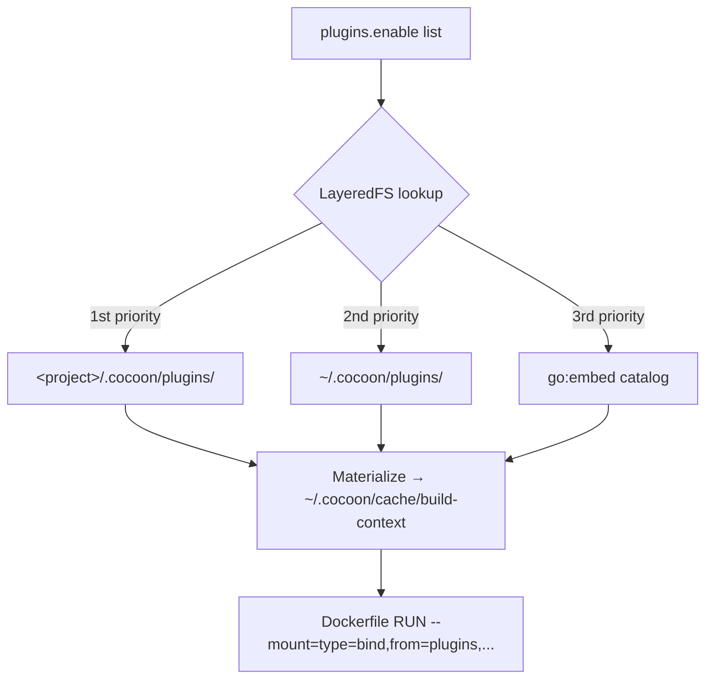
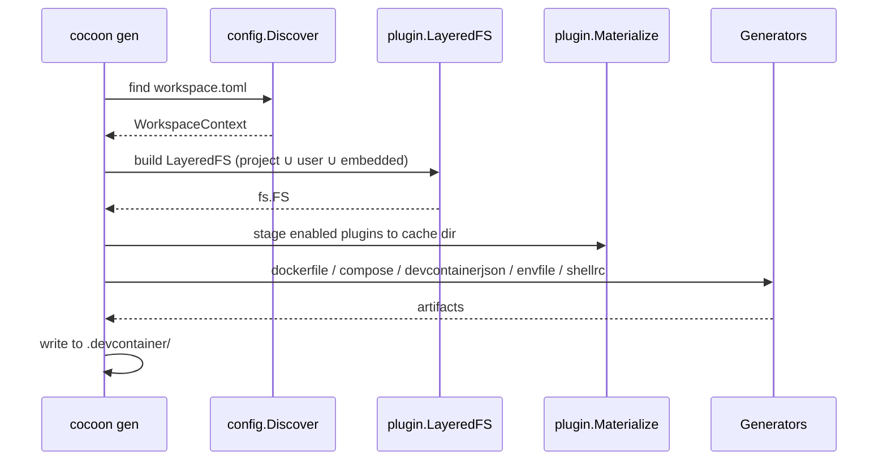

# アーキテクチャ

## 設計思想

cocoon はプロジェクト直下の `workspace.toml` を読み、必要なプラグイン資産を materialize し、`.devcontainer/` 一式を書き出すジェネレータです。コンテナのライフサイクル (build / up / down / exec) は `docker compose` か VS Code Dev Containers が担当します。

設計を貫く 3 つのルール:

1. **純粋なジェネレータ。** 出力は素の Compose + Dockerfile なので、それらを解釈できるツールならそのまま動く。
2. **IDE 中立。** 同じ `.devcontainer/` が VS Code Dev Containers でも CLI 専用ワークフローでも動く。
3. **単一の静的バイナリ。** プラグインは `go:embed` でバイナリに同梱。`curl | sh` でどこにでも入る。

## 全体フロー


`cocoon init` がユーザーを対話フォームで誘導して `workspace.toml` を書き出し、`cocoon gen` がそれを Docker / VS Code どちらでも使える `.devcontainer/` ディレクトリに変換します。

## 構成要素

| コンポーネント | パス | 役割 |
|---|---|---|
| Discovery | `internal/config/discovery.go` | cwd → `.cocoon/` → 親ディレクトリ方向に `workspace.toml` を探索 (`.git` か `$HOME` で停止)。 |
| Plugin LayeredFS | `internal/plugin/layered.go` | プロジェクト / ユーザー / 埋め込みプラグインツリーを `project > user > embedded` の優先度でオーバーレイ。 |
| Plugin Materialize | `internal/plugin/materialize.go` | 解決されたプラグインツリーを `~/.cocoon/cache/build-context/` に展開 (Docker BuildKit の bind-mount 用)。 |
| Generators | `internal/generate/{dockerfile,compose,devcontainerjson,envfile,shellrc}` | `.devcontainer/` 配下の各成果物を生成。 |
| i18n catalog | `internal/i18n/` | CLI プロンプトと `workspace.toml` 内コメントを英語 / 日本語で切替。 |

## プラグインシステム

cocoon はビルド時にバイナリ内へ 20 のプラグインを同梱します。各プラグインは `internal/plugin/catalog/<id>/{plugin.toml, install.sh}` に置かれ、3 層オーバーレイで読み込まれます。`~/.cocoon/plugins/` や `<project>/.cocoon/plugins/` にファイルを置けば上書きや追加ができます。



Materialize 後のキャッシュは Docker Compose の `additional_contexts` から参照され、生成 Dockerfile は `RUN --mount=type=bind,from=plugins,source=<id>,target=/tmp/plugin` でマウントします。

## ジェネレータパイプライン



各成果物はまずメモリ上にレンダリングされ、その後 `internal/cli/generate/WriteArtifacts` でアトミックに書き出されます。

## 生成物

```text
.devcontainer/
├── Dockerfile               # プラグインキャッシュを参照するマルチステージビルド
├── docker-compose.yml       # dev コンテナ + サイドカー用の compose ファイル
├── docker-entrypoint.sh     # named volume にイメージ焼き込み済 ~/.local をコピーするシム
├── .env                     # COMPOSE_PROJECT_NAME, CONTAINER_SERVICE_NAME, UID, GID, DOCKER_GID, OS_*
└── devcontainer.json        # [workspace] devcontainer = true のときのみ
```

`docker-entrypoint.sh` がある理由は、`~/.local/` にマウントされる named volume がイメージに焼き込まれたプラグインバイナリを rebuild 後に隠してしまうため。コンテナ起動毎に `~/.image-local/` → `~/.local/` をコピーした上で `exec "$@"` する仕組みです。

## マウント戦略

`[workspace] mount_root` でホストのどの範囲をコンテナへ見せるかを制御します。

| 値 | ホスト側 | コンテナ側 | 用途 |
|---|---|---|---|
| `"."` (デフォルト) | cwd | `/home/$USER/workspace/<service>` | 単一リポジトリ開発 |
| `".."` | cwd の親 | `/home/$USER/workspace` | 兄弟リポジトリも見える Fat ワークスペース |

`devcontainer.json::workspaceFolder` も同じ選択に追従するので、VS Code が正しいディレクトリで開きます。

## シェル注入

`[container.shell] env` と `aliases` は、イメージビルド時に Dockerfile heredoc でコンテナ内の rc ファイル (`~/.bashrc` / `~/.zshrc` / `~/.config/fish/config.fish`) に直接追記されます。`bash` / `zsh` / `fish` の構文差 (`alias k='v'` 対 `alias k 'v'`、`export K=V` 対 `set -gx K V`) はジェネレータが自動翻訳します。

```dockerfile
RUN <<COCOON_RC_BLOCK
cat >>"$HOME/.bashrc" <<'COCOON_RC'
# Auto-generated from [container.shell] of workspace.toml.
export EDITOR='vim'
alias gs='git status'
COCOON_RC
COCOON_RC_BLOCK
```

## 国際化 (i18n)

`internal/i18n/i18n.go::Detect` は次の優先順で環境変数を読みます:

1. `WORKSPACE_LANG`
2. `LC_ALL`
3. `LC_MESSAGES`
4. `LANG`

`ja` で始まる値なら日本語カタログ、それ以外は英語にフォールバック。`cocoon` 起動時に 1 回検出し、対話プロンプトと生成 `workspace.toml` のインラインコメントの両方を切り替えます。

## CI/CD

| ワークフロー | ファイル | トリガー | 役割 |
|---|---|---|---|
| Go CI | [`.github/workflows/go-ci.yml`](../.github/workflows/go-ci.yml) | push / PR / `workflow_call` | `golangci-lint` + `go vet` + `go test` + `govulncheck` + クロスコンパイル |
| E2E | [`.github/workflows/e2e.yml`](../.github/workflows/e2e.yml) | push / PR | 実 Docker でのラウンドトリップ (`cocoon init` → `gen` → `docker compose build/up/exec/down`) |
| Release | [`.github/workflows/release.yml`](../.github/workflows/release.yml) | `VERSION` 変更を含む `main` への push | タグ作成 → 各プラットフォーム向けビルド → `SHA256SUMS` 付き `gh release` 公開 |

リリースは **VERSION ファイルのバンプ駆動**です。`main` 向け PR で `VERSION` を更新するとタグ作成とバイナリ公開がトリガーされます。
