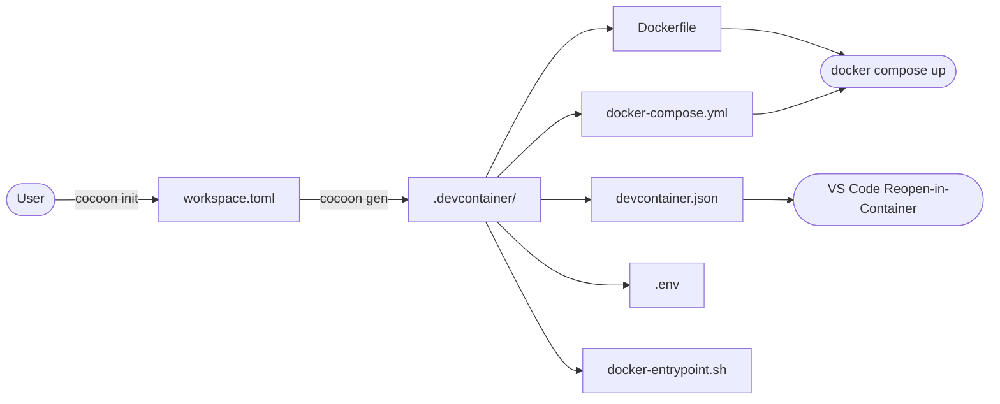
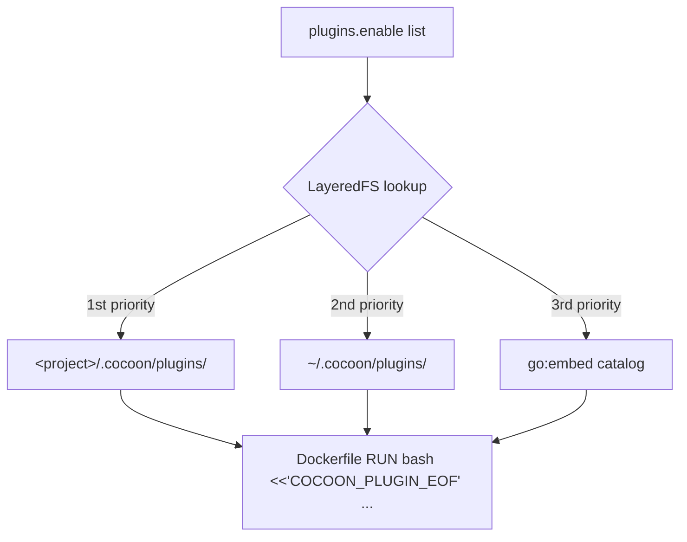
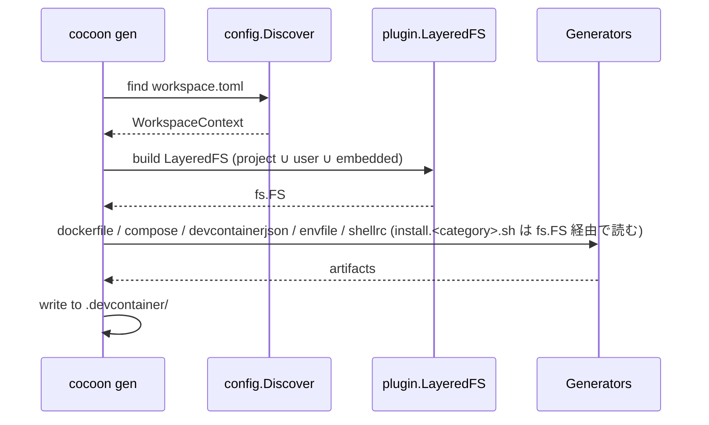

# アーキテクチャ

> [!WARNING]
> cocoon は v0.x（alpha）開発段階です。お使いになる場合は、1.0 までに CLI フラグ・`workspace.toml` スキーマ・プラグイン契約が変更され得ること、各リリースに breaking change が含まれうることをご了承のうえご利用ください。詳細は [CHANGELOG](CHANGELOG.ja.md) と README の「プロジェクトステータス」を参照してください。

## 設計思想

cocoon はプロジェクト直下の `workspace.toml` を読み、レイヤード FS でプラグイン資産を解決し、`.devcontainer/` 一式を書き出すジェネレータです。コンテナのライフサイクル (build / up / down / exec) は `docker compose` か VS Code Dev Containers が担当します。

設計を貫く 3 つのルール:

1. **純粋なジェネレータ。** 出力は素の Compose + Dockerfile なので、それらを解釈できるツールならそのまま動く。
2. **IDE 中立。** 同じ `.devcontainer/` が VS Code Dev Containers でも CLI 専用ワークフローでも動く。
3. **単一の静的バイナリ。** プラグインは `go:embed` でバイナリに同梱。`curl | sh` でどこにでも入る。

## 全体フロー



`cocoon init` がユーザーを対話フォームで誘導して `workspace.toml` を書き出し、`cocoon gen` がそれを Docker / VS Code どちらでも使える `.devcontainer/` ディレクトリに変換します。

## 構成要素

| コンポーネント | パス | 役割 |
|---|---|---|
| Discovery | `internal/config/discovery.go` | cwd → `.cocoon/` → 親ディレクトリ方向に `workspace.toml` を探索 (`.git` か `$HOME` で停止)。 |
| Plugin LayeredFS | `internal/plugin/layered.go` | プロジェクト / ユーザー / 埋め込みプラグインツリーを `project > user > embedded` の優先度でオーバーレイ。 |
| Generators | `internal/generate/{dockerfile,compose,devcontainerjson,envfile,shellrc}` | `.devcontainer/` 配下の各成果物を生成。プラグインの install スクリプトは LayeredFS から直接読み出し、bash heredoc で Dockerfile に埋め込む。 |
| Workspace generator | `internal/generate/codeworkspace` | opt-in な `cocoon gen workspace` サブコマンド。`workspace.toml` の `[code_workspace]` を読み、folder path を `~` 展開後、`.code-workspace` を書き出すディレクトリ (既定は workspace.toml と同階層、`--output` 指定時はその先) 起点で相対化し、`<name>.code-workspace` をプロジェクトルート (`.devcontainer/` 配下ではない) に書き出す。 |
| i18n catalog | `internal/i18n/` | CLI プロンプトと `workspace.toml` 内コメントを英語 / 日本語で切替。 |

## プラグインシステム

cocoon はビルド時にバイナリ内へプラグインカタログを同梱します。各プラグインは `internal/plugin/catalog/<id>/{plugin.toml, install.<category>.sh}` に置かれ、3 層オーバーレイで読み込まれます。`~/.cocoon/plugins/` や `<project>/.cocoon/plugins/` にファイルを置けば上書きや追加ができます。



ジェネレータは有効化された各プラグインの `install.<category>.sh` (および存在すれば `install_user.sh`) を LayeredFS から直接読み込み、シングルクオートの heredoc (`bash <<'COCOON_PLUGIN_EOF' … COCOON_PLUGIN_EOF`) でその内容をそのまま Dockerfile に埋め込みます。スクリプト固有の env (PIN / CHECKSUM_* / RC_FILE 等) は同じ `RUN` 行に並べることで、後段のレイヤに `ENV` として漏らさず当該ステップに閉じ込めます。ホスト側のキャッシュディレクトリは作りません — ビルドはプロジェクトツリー以外を必要としないため、ホストでも dev コンテナ内でも同じように `cocoon gen` が動作します。

## ジェネレータパイプライン



各成果物はまずメモリ上にレンダリングされ、その後 `internal/cli/generate/WriteArtifacts` でアトミックに書き出されます。

## 生成物

```text
.devcontainer/
├── Dockerfile               # コンテナビルド定義。プラグイン install スクリプトを heredoc で埋め込み
├── docker-compose.yml       # dev コンテナ + サイドカー用の compose ファイル
├── docker-entrypoint.sh     # ユーザーをホスト UID/GID へ再マッピングし、イメージ焼き込み済 ~/.local を named volume へ同期
├── .env                     # COMPOSE_PROJECT_NAME, CONTAINER_SERVICE_NAME, USERNAME, IMAGE, IMAGE_VERSION (ホスト非依存)
└── devcontainer.json        # [workspace] devcontainer = true のときのみ
```

`docker-entrypoint.sh` はコンテナ起動毎に root で動きます。まずコンテナユーザーの UID/GID をバインドマウントされたワークスペースのホスト側所有者に合わせて再マッピングし (これが生成された `.devcontainer/` をホスト非依存にしている)、次に `setpriv` でそのユーザーへ権限を落として自身を再実行します。非特権ユーザーとして再入したパスで `~/.image-local/` → `~/.local/` をコピーし (`~/.local/` の named volume がイメージ焼き込みバイナリを rebuild 後に隠すのを防ぐ)、コマンドを `exec` します。

## マウント戦略

`[workspace] mount_root` でホストのどの範囲をコンテナへ見せるかを制御します。

| 値 | ホスト側 | コンテナ側 | 用途 |
|---|---|---|---|
| `"."` (デフォルト) | cwd | `/home/$USER/<dir>/<service>` | 単一リポジトリ開発 |
| `".."` | cwd の親 | `/home/$USER/<dir>` | 兄弟リポジトリも見える Fat ワークスペース |

`<dir>` は既定で `workspace`、`[workspace] dir` で上書きできます (例: `dir = "work/myproject"`)。AWS SAM などコンテナ内パスをホスト構成に合わせたいツール向け。スラッシュで多段階層も可で、値は `/home/$USER/` 配下にそのまま展開されます。

`devcontainer.json::workspaceFolder` も同じ選択に追従するので、VS Code が正しいディレクトリで開きます。

### 永続化ボリューム

ユーザー編集のファイルがコンテナリビルドで初期化されないよう、以下の named volume が常時マウントされます:

| ボリューム | コンテナ側パス | 用途 |
|---|---|---|
| `local` | `/home/$USER/.local` | XDG runtime / state — シェル履歴、言語ツールチェーンのキャッシュなど |
| `cocoon` | `/home/$USER/.cocoon` | ユーザー個人のシェル設定: `.shellrc` (POSIX) / `.shellrc.fish` |

イメージは `~/.cocoon/.shellrc{,.fish}` をコメントだけのプレースホルダで焼き込んでおき、初回 `docker compose up` で Docker が空 volume にコピーします。以降は volume が永続層を担い、`docker compose down -v` でのみリセットされます。ホスト `~/.cocoon/` とは無関係 (ホスト側はプラグインオーバーレイと証明書置き場として cocoon CLI が使う作業領域)。

## シェル注入

`[container.shell] env` と `aliases` は、イメージビルド時に Dockerfile heredoc でコンテナ内の rc ファイル (`~/.bashrc` / `~/.zshrc` / `~/.config/fish/config.fish`) に直接追記されます。`bash` / `zsh` / `fish` の構文差 (`alias k='v'` 対 `alias k 'v'`、`export K=V` 対 `set -gx K V`) はジェネレータが自動翻訳します。

同じ heredoc の末尾に、`cocoon` named volume にある永続シェル設定を source する 1 行も常時追加されます。これによりユーザーごとの編集がコンテナリビルドを跨いでも残ります:

```dockerfile
RUN <<COCOON_RC_BLOCK
cat >>"$HOME/.bashrc" <<'COCOON_RC'
# Auto-generated from [container.shell] of workspace.toml.
export EDITOR=vim
export NPM_CONFIG_PREFIX="$HOME/.local"
alias gs='git status'

# Source persistent user shellrc from the cocoon named volume
[ -f "$HOME/.cocoon/.shellrc" ] && . "$HOME/.cocoon/.shellrc"
COCOON_RC
COCOON_RC_BLOCK
```

env の値はダブルクォートのセマンティクスで出力します (安全文字のみの値はクォート無し、それ以外は `"..."` で囲み `$` はそのまま残す) ため、rc を source する時点で `$HOME` / `$PATH` などがシェルにより展開されます。`$(cmd)` コマンド置換は bash/zsh と fish 3.4+ で動作します。それ以前の fish では fish 固有の `(cmd)` 記法を使ってください。リテラルの `$` は値が `\$` を含む必要があり、TOML では通常文字列 `"\\$RAW"` かリテラル文字列 `'\$RAW'` と書きます。alias の本文はシングルクォートで出力します。alias は呼び出し時にシェルが本文を再パースするので、`$1` や `$HOME` を含めても呼び出し時に正しく解釈されます。

bash / zsh は `~/.cocoon/.shellrc`、fish は `~/.cocoon/.shellrc.fish` を source します。`[container.shell]` 未設定でも常に出力されるので、ユーザーは再生成なしで永続ファイルを編集できます。

## 国際化 (i18n)

`internal/i18n/i18n.go::Detect` は次の優先順で環境変数を読みます:

1. `WORKSPACE_LANG`
2. `LC_ALL`
3. `LC_MESSAGES`
4. `LANG`

`ja` で始まる値なら日本語カタログ、それ以外は英語にフォールバック。`cocoon` 起動時に 1 回検出し、対話プロンプトと生成 `workspace.toml` のインラインコメントの両方を切り替えます。

## CI/CD

| ワークフロー | ファイル | トリガー | 役割 |
|---|---|---|---|
| Go CI | [`.github/workflows/go-ci.yml`](../.github/workflows/go-ci.yml) | push / PR / `workflow_call` | `golangci-lint` + `go vet` + `go test` + `govulncheck` + クロスコンパイル |
| E2E | [`.github/workflows/e2e.yml`](../.github/workflows/e2e.yml) | push / PR | サポート対象 base image 全種に対して `minimal` プリセットの実 Docker ラウンドトリップ (`cocoon init` → `gen` → `docker buildx bake` → `docker compose up/exec`、teardown は `trap` 経由) |
| Scheduled E2E | [`.github/workflows/scheduled-e2e.yml`](../.github/workflows/scheduled-e2e.yml) | Mon 06:00 UTC + `workflow_dispatch` | プラグイン全部入りラウンドトリップ (`amd64-full` + `arm64-full`) を PR クリティカルパスから分離。`workflow_dispatch` の `preset` 入力で新規プラグインを手動検証可能 |
| Release | [`.github/workflows/release.yml`](../.github/workflows/release.yml) | `VERSION` 変更を含む `main` への push | タグ作成 → 各プラットフォーム向けビルド → `SHA256SUMS` 付き `gh release` 公開 |

リリースは **VERSION ファイルのバンプ駆動**です。`main` 向け PR で `VERSION` を更新するとタグ作成とバイナリ公開がトリガーされます。
