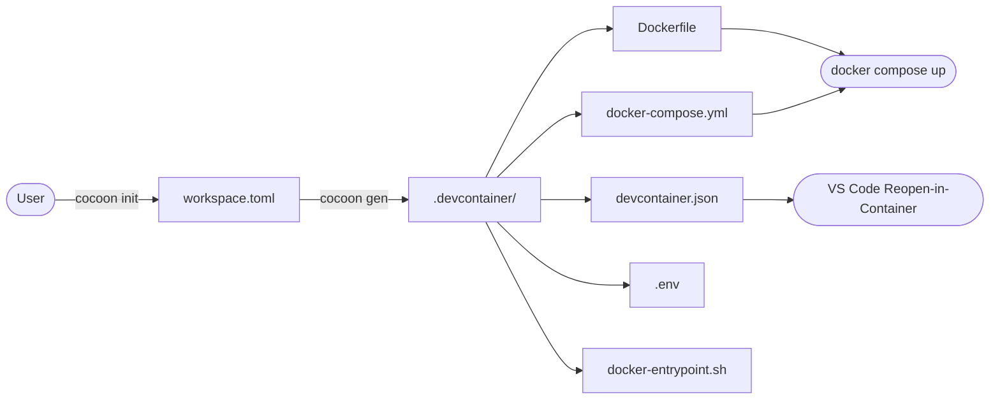
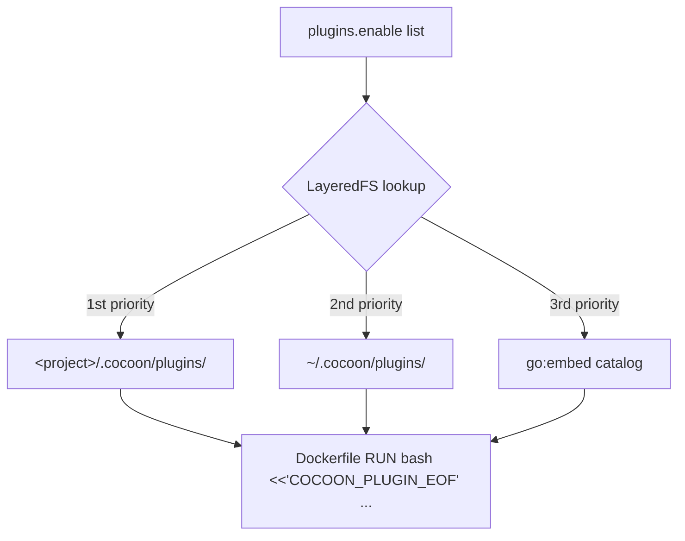
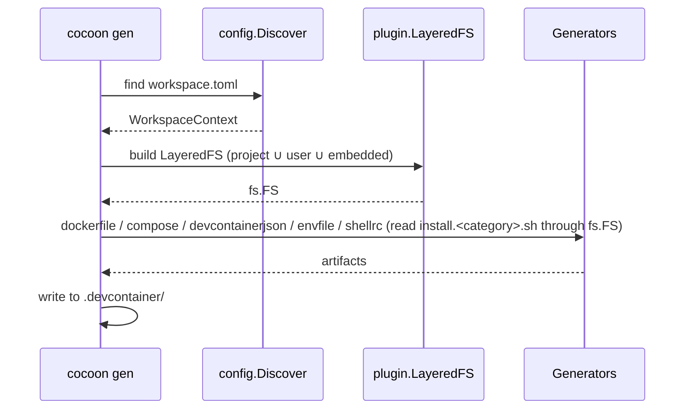

# Architecture

> [!WARNING]
> cocoon is in v0.x (alpha). By using it, please understand and accept that the CLI flags, `workspace.toml` schema, and plugin contracts may change before 1.0, and that breaking changes can land in any release. See the [CHANGELOG](../CHANGELOG.md) and the README's "Project status" section.

## Design philosophy

cocoon reads a project-local `workspace.toml`, assembles the relevant plugin assets via a layered file source, and writes a `.devcontainer/` stack. Container lifecycle (build / up / down / exec) is handled by `docker compose` or VS Code Dev Containers.

Three rules drive the design:

1. **Pure generator.** The output is plain Compose + Dockerfile, so any tool that speaks them works.
2. **IDE-neutral.** The same `.devcontainer/` runs under both VS Code Dev Containers and CLI-only workflows.
3. **Single static binary.** Plugins ship inside the binary via `go:embed`; `curl | sh` installs cocoon anywhere.

## High-level flow



`cocoon init` walks the user through an interactive form and writes `workspace.toml`. `cocoon gen` then turns that file into a `.devcontainer/` directory consumable by either Docker or VS Code.

## Components

| Component | Path | Role |
|---|---|---|
| Discovery | `internal/config/discovery.go` | Walks cwd → `.cocoon/` → parents to locate `workspace.toml`, stopping at `.git` or `$HOME`. |
| Plugin LayeredFS | `internal/plugin/layered.go` | Overlays project / user / embedded plugin trees with priority `project > user > embedded`. |
| Generators | `internal/generate/{dockerfile,compose,devcontainerjson,envfile,shellrc}` | Emit each artifact under `.devcontainer/`. Plugin install scripts are read directly from the LayeredFS and inlined into the generated Dockerfile via a quoted bash heredoc. |
| Workspace generator | `internal/generate/codeworkspace` | Opt-in `cocoon gen workspace` subcommand. Reads `[code_workspace]` from `workspace.toml`, `~`-expands folder paths and relativizes them against the directory the `.code-workspace` file is written to (the workspace.toml directory by default, or `--output` when set), and writes `<name>.code-workspace` at the project root (not under `.devcontainer/`). |
| i18n catalog | `internal/i18n/` | Switches CLI prompts and inline `workspace.toml` comments between English and Japanese. |

## Plugin system

cocoon ships its plugin catalog inside the binary at build time. Each plugin lives under `internal/plugin/catalog/<id>/{plugin.toml, install.<category>.sh}` and is loaded through a 3-layer overlay so users can override or add plugins by dropping files under `~/.cocoon/plugins/` or `<project>/.cocoon/plugins/`.



The generator reads each enabled plugin's `install.<category>.sh` (and `install_user.sh`, when present) directly from the LayeredFS and inlines the verbatim contents into the Dockerfile under a single-quoted heredoc (`bash <<'COCOON_PLUGIN_EOF' … COCOON_PLUGIN_EOF`). Per-script env vars (PIN / CHECKSUM_* / RC_FILE / etc.) live on the same `RUN` line so they stay scoped to that step. No host cache directory is created — the build needs nothing beyond the project tree itself, which is what makes `cocoon gen` work the same way from inside the dev container as from the host.

## Generator pipeline



Each artifact is rendered into memory first, then written atomically through `internal/cli/generate/WriteArtifacts`.

## Generated artifacts

```text
.devcontainer/
├── Dockerfile               # Container build; plugin install scripts inlined as heredocs
├── docker-compose.yml       # Compose file for the dev container + sidecars
├── docker-entrypoint.sh     # Remaps the user to the host UID/GID, then syncs image-baked ~/.local into the named volume
├── .env                     # COMPOSE_PROJECT_NAME, CONTAINER_SERVICE_NAME, USERNAME, IMAGE, IMAGE_VERSION (host-independent)
└── devcontainer.json        # Only when [workspace] devcontainer = true
```

`docker-entrypoint.sh` runs as root on every container start. It first remaps the container user's UID/GID to the host owner of the bind-mounted workspace — this is what makes the committed `.devcontainer/` host-independent — then drops privileges and re-execs itself as that user via `setpriv`. The unprivileged re-entry copies `~/.image-local/` → `~/.local/` (the named volume on `~/.local/` would otherwise hide image-baked plugin binaries on rebuild) before `exec`'ing the command.

## Mount strategy

`[workspace] mount_root` controls which slice of the host filesystem is exposed to the container.

| Value | Host source | Container target | Use case |
|---|---|---|---|
| `"."` (default) | cwd | `/home/$USER/<dir>/<service>` | Single-repo development |
| `".."` | parent of cwd | `/home/$USER/<dir>` | Fat workspace where sibling repos must be visible |

`<dir>` defaults to `workspace` and can be overridden via `[workspace] dir` (e.g. `dir = "work/myproject"`) when the in-container path needs to mirror a specific host layout — useful for tools like AWS SAM that key off absolute paths. Multi-segment values land verbatim under `/home/$USER/`.

`devcontainer.json::workspaceFolder` follows the same choice so VS Code lands in the right directory.

### Persistent state volumes

Two named Docker volumes are mounted unconditionally so user-writable state survives container rebuilds:

| Volume | Container path | Holds |
|---|---|---|
| `local` | `/home/$USER/.local` | XDG runtime / state — shell history, language tooling caches, etc. |
| `cocoon` | `/home/$USER/.cocoon` | User shellrc additions: `.shellrc` (POSIX) and `.shellrc.fish`. |

The image seeds `~/.cocoon/.shellrc{,.fish}` with comment-only placeholders; on first `docker compose up` Docker copies them into the empty named volume and from then on the volume is the source of truth. `docker compose down -v` resets it. The host directory `~/.cocoon/` is unrelated — that path holds the cocoon CLI's plugin overlays and certificates, neither of which are bind-mounted into the container.

## Shell injection

`[container.shell] env` and `aliases` are written directly into the container's rc file (`~/.bashrc`, `~/.zshrc`, or `~/.config/fish/config.fish`) at image build time using a Dockerfile heredoc. `bash` / `zsh` / `fish` syntax differences (`alias k='v'` vs `alias k 'v'`, `export K=V` vs `set -gx K V`) are handled automatically.

The same heredoc also appends a final line that sources the user's persistent shellrc from the `cocoon` named volume (see "Persistent state volumes" above), so per-user edits survive container rebuilds without the user having to wire it up:

```dockerfile
RUN <<COCOON_RC_BLOCK
cat >>"$HOME/.bashrc" <<'COCOON_RC'
# Auto-generated from [container.shell] of workspace.toml.
export EDITOR=vim
export NPM_CONFIG_PREFIX="$HOME/.local"
alias gs='git status'

# Source persistent user shellrc from the cocoon named volume
[ -f "$HOME/.cocoon/.shellrc" ] && . "$HOME/.cocoon/.shellrc"
COCOON_RC
COCOON_RC_BLOCK
```

Env values are emitted with double-quote semantics (fully-safe values stay unquoted; anything else is wrapped in `"..."`, with `$` left intact) so references like `$HOME` / `$PATH` are expanded by the shell when the rc file is sourced. `$(cmd)` command substitution works on bash/zsh and on fish 3.4+; older fish needs the native `(cmd)` form. A literal `$` requires the value to contain `\$` — write that in TOML as a basic string `"\\$RAW"` or a literal string `'\$RAW'`. Alias bodies use single quotes because the shell re-parses them on invocation, so `$1` and `$HOME` inside an alias still resolve at call time.

Bash / zsh source `~/.cocoon/.shellrc`; fish sources `~/.cocoon/.shellrc.fish`. The bootstrap is unconditional (it always emits, even when `[container.shell]` is unset), so the user can always edit the persistent file without re-generating.

## i18n

`internal/i18n/i18n.go::Detect` reads, in priority order:

1. `WORKSPACE_LANG`
2. `LC_ALL`
3. `LC_MESSAGES`
4. `LANG`

Any value starting with `ja` selects the Japanese catalog; everything else falls back to English. The detection runs once per `cocoon` invocation and switches both interactive prompts and the inline comments embedded in the generated `workspace.toml`.

## CI/CD

| Workflow | File | Triggers | Purpose |
|---|---|---|---|
| Go CI | [`.github/workflows/go-ci.yml`](../.github/workflows/go-ci.yml) | push / PR / `workflow_call` | `golangci-lint` + `go vet` + `go test` + `govulncheck` + cross-compile |
| E2E | [`.github/workflows/e2e.yml`](../.github/workflows/e2e.yml) | push / PR | Real Docker round-trip with the `minimal` preset across every supported base image (`cocoon init` → `gen` → `docker buildx bake` → `docker compose up/exec`; teardown via `trap`) |
| Scheduled E2E | [`.github/workflows/scheduled-e2e.yml`](../.github/workflows/scheduled-e2e.yml) | Mon 06:00 UTC + `workflow_dispatch` | Plugin-heavy round-trip (`amd64-full` + `arm64-full`) split off the PR critical path; `workflow_dispatch` accepts a `preset` input for verifying new plugins on demand |
| Release | [`.github/workflows/release.yml`](../.github/workflows/release.yml) | push to `main` with `VERSION` change | Tag, build per-platform binaries, publish `gh release` with `SHA256SUMS` |

The release workflow is **VERSION-bump driven**: bumping the `VERSION` file in a PR to `main` triggers tag creation and binary publication.
