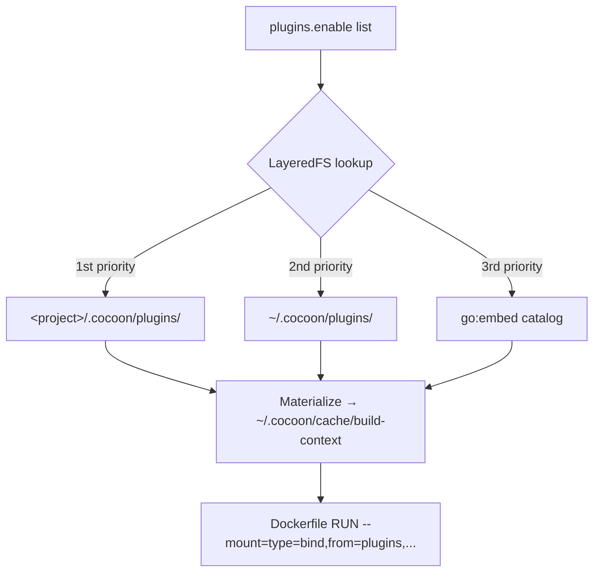
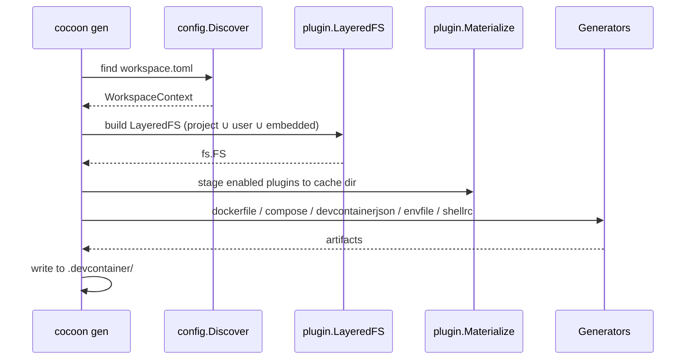

# Architecture

## Design philosophy

cocoon reads a project-local `workspace.toml`, materializes the relevant plugin assets, and writes a `.devcontainer/` stack. Container lifecycle (build / up / down / exec) is handled by `docker compose` or VS Code Dev Containers.

Three rules drive the design:

1. **Pure generator.** The output is plain Compose + Dockerfile, so any tool that speaks them works.
2. **IDE-neutral.** The same `.devcontainer/` runs under both VS Code Dev Containers and CLI-only workflows.
3. **Single static binary.** Plugins ship inside the binary via `go:embed`; `curl | sh` installs cocoon anywhere.

## High-level flow


`cocoon init` walks the user through an interactive form and writes `workspace.toml`. `cocoon gen` then turns that file into a `.devcontainer/` directory consumable by either Docker or VS Code.

## Components

| Component | Path | Role |
|---|---|---|
| Discovery | `internal/config/discovery.go` | Walks cwd → `.cocoon/` → parents to locate `workspace.toml`, stopping at `.git` or `$HOME`. |
| Plugin LayeredFS | `internal/plugin/layered.go` | Overlays project / user / embedded plugin trees with priority `project > user > embedded`. |
| Plugin Materialize | `internal/plugin/materialize.go` | Stages the resolved plugin tree to `~/.cocoon/cache/build-context/` so Docker BuildKit can mount it. |
| Generators | `internal/generate/{dockerfile,compose,devcontainerjson,envfile,shellrc}` | Emit each artifact under `.devcontainer/`. |
| i18n catalog | `internal/i18n/` | Switches CLI prompts and inline `workspace.toml` comments between English and Japanese. |

## Plugin system

cocoon ships 20 plugins inside the binary at build time. Each plugin lives under `internal/plugin/catalog/<id>/{plugin.toml, install.sh}` and is loaded through a 3-layer overlay so users can override or add plugins by dropping files under `~/.cocoon/plugins/` or `<project>/.cocoon/plugins/`.



The materialized cache is referenced by Docker Compose via `additional_contexts`, and the generated Dockerfile mounts it through `RUN --mount=type=bind,from=plugins,source=<id>,target=/tmp/plugin`.

## Generator pipeline



Each artifact is rendered into memory first, then written atomically through `internal/cli/generate/WriteArtifacts`.

## Generated artifacts

```text
.devcontainer/
├── Dockerfile               # Multi-stage build referencing the plugin cache
├── docker-compose.yml       # Compose file for the dev container + sidecars
├── docker-entrypoint.sh     # Tiny shim that copies image-baked ~/.local files into the named volume
├── .env                     # COMPOSE_PROJECT_NAME, CONTAINER_SERVICE_NAME, UID, GID, DOCKER_GID, OS_*
└── devcontainer.json        # Only when [workspace] devcontainer = true
```

`docker-entrypoint.sh` exists because the named volume mounted on `~/.local/` would otherwise hide image-baked plugin binaries on rebuild. The entrypoint copies `~/.image-local/` → `~/.local/` on every container start, then `exec "$@"`.

## Mount strategy

`[workspace] mount_root` controls which slice of the host filesystem is exposed to the container.

| Value | Host source | Container target | Use case |
|---|---|---|---|
| `"."` (default) | cwd | `/home/$USER/workspace/<service>` | Single-repo development |
| `".."` | parent of cwd | `/home/$USER/workspace` | Fat workspace where sibling repos must be visible |

`devcontainer.json::workspaceFolder` follows the same choice so VS Code lands in the right directory.

## Shell injection

`[container.shell] env` and `aliases` are written directly into the container's rc file (`~/.bashrc`, `~/.zshrc`, or `~/.config/fish/config.fish`) at image build time using a Dockerfile heredoc. `bash` / `zsh` / `fish` syntax differences (`alias k='v'` vs `alias k 'v'`, `export K=V` vs `set -gx K V`) are handled automatically.

```dockerfile
RUN <<COCOON_RC_BLOCK
cat >>"$HOME/.bashrc" <<'COCOON_RC'
# Auto-generated from [container.shell] of workspace.toml.
export EDITOR='vim'
alias gs='git status'
COCOON_RC
COCOON_RC_BLOCK
```

## i18n

`internal/i18n/i18n.go::Detect` reads, in priority order:

1. `WORKSPACE_LANG`
2. `LC_ALL`
3. `LC_MESSAGES`
4. `LANG`

Any value starting with `ja` selects the Japanese catalog; everything else falls back to English. The detection runs once per `cocoon` invocation and switches both interactive prompts and the inline comments embedded in the generated `workspace.toml`.

## CI/CD

| Workflow | File | Triggers | Purpose |
|---|---|---|---|
| Go CI | [`.github/workflows/go-ci.yml`](../.github/workflows/go-ci.yml) | push / PR / `workflow_call` | `golangci-lint` + `go vet` + `go test` + `govulncheck` + cross-compile |
| E2E | [`.github/workflows/e2e.yml`](../.github/workflows/e2e.yml) | push / PR | Real Docker round-trip (`cocoon init` → `gen` → `docker compose build/up/exec/down`) |
| Release | [`.github/workflows/release.yml`](../.github/workflows/release.yml) | push to `main` with `VERSION` change | Tag, build per-platform binaries, publish `gh release` with `SHA256SUMS` |

The release workflow is **VERSION-bump driven**: bumping the `VERSION` file in a PR to `main` triggers tag creation and binary publication.
